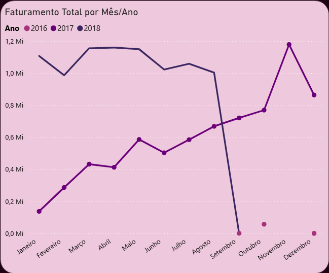
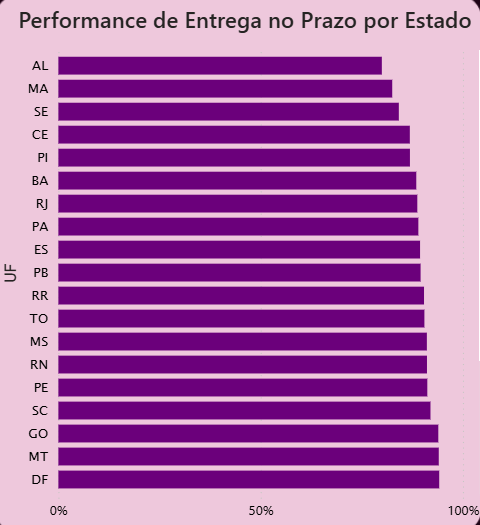

# 📊 Dashboard de Performance de Vendas & Logística (Olist)

## 🖼️ Visão Geral do Painel

*(Visão geral do painel executivo focado em KPIs de vendas e logística)*

## 💼 O Desafio de Negócio

Este projeto analisa dados reais do **Olist** (E-commerce brasileiro) para responder a perguntas estratégicas da diretoria sobre a operação entre 2016 e 2018:
1.  **Evolução do Faturamento:** O crescimento das vendas é consistente ou sazonal?
2.  **Eficiência Logística:** Onde estão os gargalos de entrega no Brasil?
3.  **SLA de Entrega:** Estamos cumprindo o prazo prometido ao cliente?

## 🛠️ Tecnologias Utilizadas

* **SQL Server:** Extração, limpeza de dados (Data Cleaning) e criação de Views para otimizar a performance.
* **Power BI:** Modelagem de dados (Star Schema), cálculos avançados DAX e Storytelling.
* **PowerPoint:** Criação de background e identidade visual personalizada.

## ⚙️ Etapas do Projeto

### 1. Tratamento de Dados (SQL)
Os dados brutos continham problemas de tipagem e registros nulos. Foi criada uma View (`vw_fVendas`) no SQL para garantir a integridade antes da importação:
* Correção de tipos de dados (String para Decimal em valores monetários).
* Cálculo de `Dias_Atraso` direto na fonte.
* Unificação de tabelas de Pedidos e Itens.

### 2. Modelagem (Star Schema)
No Power BI, o modelo foi estruturado com tabela Fato (`fVendas`) e Dimensões (`dCalendario`, `dClientes`, `dProdutos`), garantindo alta performance nos filtros.

### 3. Análises e DAX
Principais medidas criadas:
* **% SLA de Entrega:** `CALCULATE(COUNTROWS(Vendas), Dias_Atraso <= 0) / COUNTROWS(Vendas)`
* **Ticket Médio:** Análise do valor médio gasto por pedido.
* **Comparativo Anual:** Visualização de tendências ano contra ano (YoY) para identificar sazonalidade.

## 🚀 Principais Insights

### 1. Evolução do Faturamento

* **📈 Crescimento Acelerado (Jan-Ago):** Ao comparar o mesmo período (Janeiro a Agosto), observa-se que 2018 superou consistentemente o faturamento de 2017, validando a tendência de alta.
* **⚠️ Observação sobre os Dados:** A queda abrupta observada a partir de setembro de 2018 reflete o **fim da janela temporal do dataset público**, e não uma queda real no desempenho de vendas da empresa.

### 2. Performance Logística

* **🎯 SLA Global vs Meta:** O indicador geral de entregas no prazo fechou em **93,55%**, ficando ligeiramente abaixo da meta estratégica de 95%.
* **🚚 Gargalo Regional Crítico:** Aprofundando a visão, identificou-se uma disparidade severa. Enquanto o Sudeste mantém entregas acima de 90%, estados do Nordeste como **Alagoas (AL)** e **Maranhão (MA)** sofrem com taxas abaixo de 85%.
    * *Ação Recomendada:* Revisão urgente de transportadoras parceiras para a região Nordeste ou ajuste preventivo do prazo prometido no checkout (Lead Time).

## 📂 Fonte de Dados

O conjunto de dados utilizado neste projeto é público e foi disponibilizado pela **Olist** (maior loja de departamentos dos marketplaces brasileiros).

* **Dataset:** Brazilian E-Commerce Public Dataset by Olist
* **Período Analisado:** 2016 a 2018
* **Registros:** +100k pedidos reais (anonimizados)
---
**Autor:** Milena Soares de Oliveira
[LinkedIn](https://www.linkedin.com/in/milena-soares12/)
